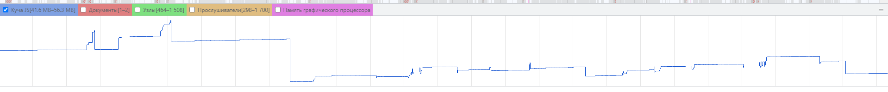
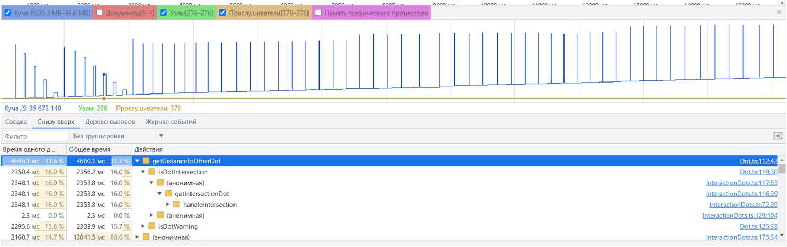

В приложение утечек памяти не наблюдается. Скачки памяти обусловлены переходами на страницы приложения.

После внедрения SSR заметно для глаза провисла производительность игры. На скриншоте также видна утечка памяти.

Проделанные оптимизации:

1. оптимизирован алгоритм поиска точек.

2. x и y координаты точек теперь округлены, чтобы формула подсчета расстояния не работала с большими долями

3. уменьшено количество кадров в секунду до 30 кадров.

Итог оптимизаций: время обработки одного кадра уменьшено. Торможений в игре не наблюдается.

На ниже скриншоте видно, что обработчик мусора отрабатывает. Скачки памяти - частый рендеринг canvas.

